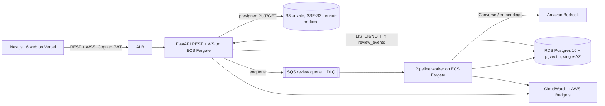

# AGENTS.md: Compliance Review Copilot

> Instructions for coding agents (Cursor, Claude Code, Codex).
> **Product spec:** [`docs/PRD.md`](docs/PRD.md), [`docs/DESIGN-SYSTEM.md`](docs/DESIGN-SYSTEM.md), [`docs/ACCEPTANCE-CRITERIA.md`](docs/ACCEPTANCE-CRITERIA.md). They win on any conflict.
> **Layout:** [`docs/STRUCTURE.md`](docs/STRUCTURE.md)
> **Runtime AI spec:** `ai/` (agents, packs, skills, rules). Read `ai/README.md` before touching the pipeline.

## What this is
Users upload contracts and policies into a **project** (multiple documents, selected frameworks). A multi-agent pipeline drafts findings against GDPR and SOC 2 (in depth) and ISO/IEC 27001, HIPAA, and Internal Policy (Preview packs). Each finding carries verbatim, machine-verified citations, a severity, and a confidence band. Findings stream live to reviewers, who accept, reject, edit, or escalate them together. The project produces one versioned, audit-ready report (PDF + JSON), which the Owner signs off with an attestation.

## Architecture (MVP, one environment)

- **API** (`apps/api`): thin entry; implementation in `packages/complibot`. FastAPI, Pydantic v2, SQLAlchemy 2 + Alembic. Routes under `/v1`. WebSocket at `/v1/reviews/{reviewId}/ws`.
- **Worker** (`apps/worker`): thin entry; pipeline in `packages/complibot/src/complibot_worker`. SQS long-poll, 3 retries, then DLQ.
- **Realtime**: transactional outbox in `review_events`, `LISTEN/NOTIFY` fan-out. Contract: `packages/schemas/events.yaml` (from `ai/agents/schemas/`).
- **Auth**: Cognito JWT; per-project roles `owner` | `reviewer` | `viewer`.
- **Framework packs at runtime**: `ai/frameworks/` (no duplicate tree).
- **Contracts**: `packages/schemas/` → codegen for Pydantic + TS.

## Repo layout
```
apps/api/            Service entry + alembic.ini
apps/worker/         Service entry
apps/web/            Next.js 16 app router
packages/complibot/  Python src: complibot + complibot_worker
packages/schemas/    YAML wire schemas (codegen input)
ai/                  Runtime agents, frameworks, skills, rules
docs/                PRD, design system, acceptance criteria, sources/
data/fixtures/       Sample contracts for demo
database/            Alembic migrations (when added)
eval/                gold/vN/, results/
infra/terraform/     AWS demo env
scripts/             bootstrap, LocalStack, packs-validate, codegen
tests/               pytest
```

## Commands
| Task | Command |
|------|---------|
| Bootstrap | `make bootstrap` (uv sync, pnpm i) |
| Local stack | `make up` (docker compose: postgres+pgvector, LocalStack) |
| API / worker / web | `make api` · `make worker` · `pnpm -C apps/web dev` |
| Migrations | `uv run alembic -c apps/api/alembic.ini upgrade head` |
| Codegen | `make schemas` |
| Lint / types | `uv run ruff check packages tests scripts` · `pnpm -C apps/web typecheck` |
| Tests | `uv run pytest -q` |
| Eval | `uv run python eval/run_eval.py` |
| Packs | `make packs-validate` (validates `ai/frameworks/`) |

## Conventions
- Python 3.12, `uv`, ruff. `PYTHONPATH=packages/complibot/src;.`
- Prompts: `packages/complibot/src/complibot_worker/prompts/` (sync with `ai/agents/*.md`).
- Thresholds: `ai/rules/runtime-config.yaml`.
- PRs touching prompts, `complibot_worker/pipeline/`, or `ai/frameworks/` should run the eval smoke gate when wired in CI.

## Definition of done
See the full checklist in [`ai/build/AGENTS.md`](ai/build/AGENTS.md) (extended version for build-time agents).
