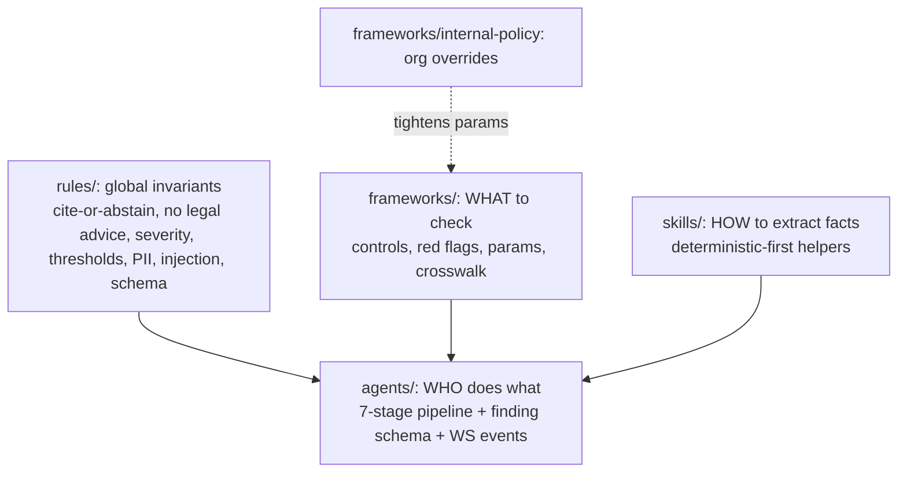

# AI definitions: Real-time AI Compliance Review Copilot

There are two layers. Keep them separate.

| Layer | Who reads it | What it controls |
|-------|--------------|------------------|
| **Runtime** (`agents/`, `frameworks/`, `skills/`, `rules/`) | The product's own pipeline workers (prompts, packs, and thresholds are loaded from here) | How documents are reviewed, cited, scored, and reported |
| **Build-time** (`build/`) | Coding agents (Cursor, Claude Code) building the app | How the codebase is structured, tested, and deployed |

The build layer *implements* the runtime layer. `build/.cursor/rules/ai-pipeline.mdc` makes `ai/` the spec, so prompt, pack, or threshold changes land here first and must pass the eval gate.

**Product source of truth:** [`docs/PRD.md`](../docs/PRD.md), [`docs/DESIGN-SYSTEM.md`](../docs/DESIGN-SYSTEM.md), and [`docs/ACCEPTANCE-CRITERIA.md`](../docs/ACCEPTANCE-CRITERIA.md). They merge the engineering and design inputs and carry decisions D-01 to D-12. `ai/` was reconciled with them on 2026-10-05 (PRD §21, C-01 to C-21). If the two ever disagree, the docs win.

## How the runtime pieces fit

- **Packs hold knowledge** (citations, requirements, red flags). **Skills compute facts** (durations, locations, subprocessors). **Agents judge** with those facts. **Rules constrain** everything. Framework facts never live in prompts.

## Index
**Runtime agents** ([agents/README.md](agents/README.md), pipeline diagram)
- [01 Orchestrator](agents/01-orchestrator.md) · [02 Ingestion & Clause Extractor](agents/02-ingestion-clause-extractor.md) · [03 Framework Mapper](agents/03-framework-mapper.md) · [04 Gap & Risk Assessor](agents/04-gap-risk-assessor.md) · [05 Remediation Writer](agents/05-remediation-writer.md) · [06 Citation Verifier](agents/06-citation-verifier.md) · [07 Report Composer](agents/07-report-composer.md)
- Contracts: [finding.schema.yaml](agents/schemas/finding.schema.yaml) (Finding + ReviewDecision) · [events.yaml](agents/schemas/events.yaml) (engineering's WS contract v1) · [cost-model.md](agents/cost-model.md) (budget vs cost targets)

**Framework packs** ([frameworks/README.md](frameworks/README.md), pack schema and authoring rules)
- [GDPR](frameworks/gdpr/) (20, full) · [SOC 2](frameworks/soc2/) (19, full) · [ISO/IEC 27001:2022](frameworks/iso27001/) (22, Preview) · [HIPAA](frameworks/hipaa/) (20, Preview) · [Internal Policy sample](frameworks/internal-policy/) (5, Preview)

**Runtime skills**
- [clause-segmentation](skills/clause-segmentation/SKILL.md) · [pii-phi-detection](skills/pii-phi-detection/SKILL.md) · [retention-period-extraction](skills/retention-period-extraction/SKILL.md) · [breach-notification-timeline](skills/breach-notification-timeline/SKILL.md) · [cross-border-transfer](skills/cross-border-transfer/SKILL.md) · [subprocessor-analysis](skills/subprocessor-analysis/SKILL.md) · [confidence-calibration](skills/confidence-calibration/SKILL.md)

**Runtime rules**
- [01 cite-or-abstain](rules/01-cite-or-abstain.md) · [02 no legal advice](rules/02-no-legal-advice.md) · [03 severity rubric](rules/03-severity-rubric.md) · [04 confidence bands](rules/04-confidence-thresholds.md) · [05 PII handling](rules/05-pii-handling.md) · [06 prompt-injection defence](rules/06-prompt-injection-defence.md) · [07 schema validation](rules/07-schema-validation.md) · [runtime-config.yaml](rules/runtime-config.yaml) (all numeric thresholds)

**Build-time**
- [build/AGENTS.md](build/AGENTS.md): architecture, commands, conventions, definition of done
- `.cursor/rules`: [python-fastapi](build/.cursor/rules/python-fastapi.mdc) · [websocket-contract](build/.cursor/rules/websocket-contract.mdc) · [ai-pipeline](build/.cursor/rules/ai-pipeline.mdc) · [aws-iac](build/.cursor/rules/aws-iac.mdc) · [security-and-compliance](build/.cursor/rules/security-and-compliance.mdc) (always on) · [testing](build/.cursor/rules/testing.mdc) · [frontend](build/.cursor/rules/frontend.mdc)
- Skills: [add-framework-pack](build/skills/add-framework-pack/SKILL.md) · [add-websocket-event](build/skills/add-websocket-event/SKILL.md) · [run-eval-harness](build/skills/run-eval-harness/SKILL.md) · [deploy-to-aws](build/skills/deploy-to-aws/SKILL.md)

## Design invariants (the interview talking points)
1. **No evidence, no finding.** Verbatim quotes with char spans are checked by code before anything is published. Failures are retried once, then discarded and counted. Missing provisions are explicit `gap` findings with a search record.
2. **Stream drafts, act on published findings.** Tokens stream as ephemeral `finding.delta` ("Writing…", controls disabled). Only `finding.created` findings can be decided.
3. **Honest confidence, human decisions.** Bands are High / Medium / Low with a reason, never a percentage. Low confidence is a marker inside its severity group, not a separate queue. System flags are distinct from the human Escalate. There is no auto-accept, and the final report contains only human-decided findings.
4. **Deterministic first.** Regex, parsers, and skills compute facts, and the LLM judges with them. Durations, offsets, and dates never come from the LLM.
5. **Reproducible, versioned reports.** One report per project. Pack versions, prompt versions, and model IDs are pinned and printed. Owner sign-off is an attestation that locks the version, and later changes create v(n+1). Signing and hashing are stretch.
6. **Costed budgets.** Token and USD guards are sized against the per-review cost targets ([cost-model.md](agents/cost-model.md)).

## Accuracy status
Every control in the GDPR, SOC 2, ISO 27001 and HIPAA packs is `verify: confirmed` (2026-10-05). Internal Policy controls cite the organisation's own policy and have no `verify` field. Each pack README's Verification section names the primary source checked:
- GDPR: EUR-Lex and CJEU sources for the DPF.
- HIPAA: the eCFR, 45 CFR Part 164, current to 2026-10-01, and the Federal Register and Unified Agenda for the Security Rule NPRM.
- SOC 2: AICPA TSP section 100, with the 2022 points of focus.
- ISO/IEC 27001:2022: Annex A numbering.

A control that still needs a human check is marked `verify: unverified`, and strict mode refuses to load it. Run `grep -rn "verify: unverified" ai/` to list any. Facts that can change after this date (the DPF appeal, the HIPAA final rule, Bedrock models and prices) are re-checked in [deploy-to-aws](build/skills/deploy-to-aws/SKILL.md) step 8.

## Licensing and third-party content
- **This repository.** No open-source licence has been granted. Unless a `LICENSE` file is added, all rights are reserved by the author (Bharath).
- **GDPR** (Regulation (EU) 2016/679). EU legislation may be reused under Commission Decision 2011/833/EU. Articles are cited by number and requirements are paraphrased.
- **HIPAA** (45 CFR Parts 160 and 164). US federal regulations are not subject to copyright. Sections are cited by number.
- **SOC 2 / AICPA TSC.** © AICPA. Only criterion IDs are used, and every requirement is written in our own words. Do not paste criteria or points of focus.
- **ISO/IEC 27001:2022.** © ISO/IEC. Only control numbers and short titles are used, with requirements paraphrased.
- **Eval documents.** CUAD v1 (The Atticus Project) is licensed **CC BY 4.0** (atticusprojectai.org/cuad), so attribution is required in `eval/gold/*/SOURCES.md`. Synthetic documents are our own. Every other public document must be recorded in `SOURCES.md` with its licence before it is added.
