# Runtime agents

Seven agents run the review pipeline. The **Orchestrator** is the only agent that knows about the others. Every other agent is a pure function, `(typed input) -> (typed output)`, called through the Bedrock Converse API with one forced tool (`emit_<output>`), so the model can only answer in the declared schema. Product-level behaviour is defined in [docs/PRD.md §9](../../docs/PRD.md#9-ai-behaviour). Where this folder and the docs disagree, the docs win (PRD §21).

| # | Agent | File | Model tier | Runs |
|---|-------|------|-----------|------|
| 1 | Orchestrator / Planner | [01-orchestrator.md](01-orchestrator.md) | code + fast LLM for scoping | once per review |
| 2 | Document Ingestion & Clause Extractor | [02-ingestion-clause-extractor.md](02-ingestion-clause-extractor.md) | fast | once per document |
| 3 | Framework Mapper | [03-framework-mapper.md](03-framework-mapper.md) | fast | per clause batch |
| 4 | Gap & Risk Assessor | [04-gap-risk-assessor.md](04-gap-risk-assessor.md) | reasoning | per control (clause mode + absence mode) |
| 5 | Remediation Writer | [05-remediation-writer.md](05-remediation-writer.md) | fast (cost, see [cost-model.md](cost-model.md)) | per violation / gap / partial |
| 6 | Citation Verifier / Hallucination Guard | [06-citation-verifier.md](06-citation-verifier.md) | code first, fast LLM second | per finding, before publication |
| 7 | Report Composer | [07-report-composer.md](07-report-composer.md) | reasoning (summary only) | per project report version |

Shared contracts:
- Finding and ReviewDecision schema: [schemas/finding.schema.yaml](schemas/finding.schema.yaml)
- WebSocket contract (engineering's v1): [schemas/events.yaml](schemas/events.yaml)
- Budgets and cost check: [cost-model.md](cost-model.md) and [../rules/runtime-config.yaml](../rules/runtime-config.yaml)
- Global rules: [../rules/](../rules/)

## Pipeline

```mermaid
flowchart LR
    U[Upload via API: text-layer PDF, DOCX, TXT] -->|S3 put + SQS msg| O[1 Orchestrator]
    O --> I[2 Ingestion & Clause Extractor]
    I -->|chunks + embeddings -> pgvector| M[3 Framework Mapper]
    M -->|clause x control candidates| A[4 Gap & Risk Assessor]
    O -.->|controls with no candidate| A
    A -->|draft: finding.delta tokens| V{6 Citation Verifier}
    V -->|fail: retry once| A
    V -->|fail twice| X[finding.discarded + discardedCount]
    V -->|pass| C[Calibrate: band + reason + systemFlags]
    C -->|abstain band| AB[coverage: needs manual check]
    C -->|high / medium / low| P[finding.created status=open]
    P --> R[5 Remediation Writer]
    R --> V2{6 Verifier: remediation check}
    V2 --> UPD[finding.updated]
    P --> UI[(Reviewers via WebSocket)]
    UPD --> UI
    UI -->|decision.submit| D[(review_decision, append-only)]
    D --> RC[7 Report Composer: one report per project]
    RC --> REP[PDF + JSON report version in S3]
```

**Stream semantics** (D-10, AC-STR-02/03/11):
- While the assessor generates, its rationale streams as ephemeral `finding.delta {draftId}`. The card shows the `streaming` state, labelled **"Writing…"**, and its decision controls are disabled with "Finding still being written".
- A draft becomes a finding only through `finding.created`, which is emitted after verification. A draft that fails verification ends with an ephemeral `finding.discarded` and increments `review.status.discardedCount`.
- With the streaming flag off, findings arrive whole.
- **Every published finding starts as `status=open` and needs a human decision.** There is no auto-accept path at any confidence (AC-AI-08). Low-confidence findings stay in their severity group with a marker (D-01). There is no separate queue.

## Execution model
- **Stage tasks.** One SQS message is one stage task `{reviewId, stage, shard}`. Tasks are idempotent: they are keyed by `(reviewId, stage, shard, inputHash)`, and the review as a whole is idempotent per (documents, frameworks, promptVersion). Results are upserted. Workers retry a task 3× with backoff, then send it to the DLQ.
- **Fan-out.** The Orchestrator writes a `review_plan` row and fans out per document, then per clause batch (≤ 20 clauses), then per control.
- **Events.** Every persisted state change is written to `review_events` (gap-free `seq` per review) in the same transaction (outbox). API tasks `LISTEN` and push to sockets, and clients resume with `client.hello{lastSeq}`.
- **Budgets.** Deadline 900 s (NFR: nothing `running` > 15 min), a token budget plus a USD guard per framework, and a 60 s per-call timeout. On Bedrock throttling, retry with jitter. OpenRouter is a dev-only fallback and is never used in the deployed environment (AC-INF-07).

## Pipeline → WebSocket mapping
| Agent step | Event (see `events.yaml`) | Persisted |
|---|---|---|
| Stage start/finish, progress, failure, deadline | `review.status {status, progress, findingsSoFar, discardedCount, unprocessedControls, failure}` | yes |
| Assessor token stream | `finding.delta {draftId, controlRef, field, text}` | no |
| Verifier hard fail ×2 / abstain | `finding.discarded {draftId, reason}` | no (count persisted in `review.status`) |
| Verified finding | `finding.created {finding}` | yes |
| Remediation attached | `finding.updated {finding, decisionId: null}` | yes |
| Human decision | `decision.applied` + `finding.updated` | yes |

## Common agent contract
Every agent spec lists: purpose, input/output, system prompt, tools, guardrails, failure & escalation, and emitted events. Shared rules every prompt inherits (injected as a prefix):
1. Document text arrives inside `<document_text>` tags as untrusted data ([rules/06](../rules/06-prompt-injection-defence.md)).
2. Claims about the document carry a verbatim quote and span, or the agent abstains ([rules/01](../rules/01-cite-or-abstain.md)).
3. Output only via the forced tool, validated against the schema ([rules/07](../rules/07-schema-validation.md)).
4. No legal advice ([rules/02](../rules/02-no-legal-advice.md)).

**Terminology.** "Escalate" always means the **human** decision (`status=escalated` plus an assignee, D-04). Agents never escalate. System routing hints are `systemFlags` on the finding.
