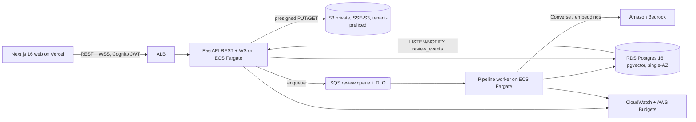

# AGENTS.md: Compliance Review Copilot

> Instructions for coding agents (Cursor, Claude Code, Codex). When the repo is scaffolded, copy this file and `.cursor/` to the repo root.
> **Product spec:** [`docs/PRD.md`](../../docs/PRD.md), [`docs/DESIGN-SYSTEM.md`](../../docs/DESIGN-SYSTEM.md), [`docs/ACCEPTANCE-CRITERIA.md`](../../docs/ACCEPTANCE-CRITERIA.md). They win on any conflict.
> **Runtime AI spec:** `ai/` (agents, packs, skills, rules). Read `ai/README.md` before touching the pipeline.

## What this is
Users upload contracts and policies into a **project** (multiple documents, selected frameworks). A multi-agent pipeline drafts findings against GDPR and SOC 2 (in depth) and ISO/IEC 27001, HIPAA, and Internal Policy (Preview packs). Each finding carries verbatim, machine-verified citations, a severity, and a confidence band. Findings stream live to reviewers, who accept, reject, edit, or escalate them together. The project produces one versioned, audit-ready report (PDF + JSON), which the Owner signs off with an attestation.

## Architecture (MVP, one environment)

- **API** (`apps/api`): FastAPI, Pydantic v2, SQLAlchemy 2 + Alembic. All routes live under `/v1`. One WebSocket per review at `/v1/reviews/{reviewId}/ws`.
- **Worker** (`apps/worker`): same codebase, a separate Fargate service that long-polls SQS and runs the stage tasks in `ai/agents`. Retries 3×, then DLQ.
- **Realtime**: transactional outbox in `review_events` (gap-free `seq` per review), fanned out with `LISTEN/NOTIFY`. The contract is `ai/agents/schemas/events.yaml` (`client.hello` / `server.welcome`, replay, `resync.required`). No Redis.
- **Auth and roles**: Cognito user pool (JWT RS256 via JWKS). Roles are **per project membership**: `owner` (manage, invite, sign off, override), `reviewer` (decide, comment), `viewer` (read-only). There are no Cognito role groups; a platform `admin` group is optional and only for ops. Tenancy is `tenant_id` on every row, enforced by the repository filter plus Postgres RLS (PRD Q-06).
- **LLM**: Bedrock with tiered, pinned models (PRD Q-03): fast tier for extraction, mapping, verification, and remediation; reasoning tier for assessment and the report summary. OpenRouter is `APP_ENV=local` only.
- **Frontend hosting**: Vercel (PRD Q-02, recommended default). AWS hosts the API, workers, and data. If Bharath chooses all-AWS (Amplify or S3 + CloudFront), only `apps/web` deploy changes.
- **Contracts**: `packages/schemas/` holds `finding.schema.yaml` and `events.yaml`, copied from `ai/agents/schemas`. They generate the Pydantic models and TS types (with OpenAPI for REST). Generated code is never hand-edited.

## Repo layout
```
apps/api/            FastAPI app (routers/, ws/, services/, db/, auth/)
apps/worker/         pipeline/ (stages), prompts/ (versioned prompt files), skills/, llm/
apps/web/            Next.js 16 app router (deployed to Vercel)
packages/schemas/    JSON Schema + event contract -> codegen
frameworks/          symlink/copy of ai/frameworks packs loaded at runtime
eval/                gold/vN/, results/<git-sha>.json, harness CLI
ai/                  runtime agent specs (source of truth for prompts, packs, rules)
infra/terraform/     modules: network, data, compute, auth, observability (one env: demo)
```

## Commands
| Task | Command |
|------|---------|
| Bootstrap | `make bootstrap` (uv sync, pnpm i, pre-commit install) |
| Local stack | `make up` (docker compose: postgres+pgvector, LocalStack S3/SQS, mock JWKS) |
| API / worker / web | `make api` · `make worker` · `pnpm -C apps/web dev` |
| Migrations | `uv run alembic -c apps/api/alembic.ini upgrade head` · new: `... revision --autogenerate -m "msg"` |
| Codegen | `make schemas` |
| Lint / types | `uv run ruff check . && uv run ruff format --check . && uv run mypy apps` · `pnpm -C apps/web lint typecheck` |
| Tests | `uv run pytest -q` · `pnpm -C apps/web test` · `pnpm -C apps/web e2e` |
| Eval | `eval run --gold v0 --frameworks GDPR,SOC2 --prompt-version X` (see `build/skills/run-eval-harness`) |
| Packs | `make packs-validate` |
| Infra | `make tf-plan` / `make tf-apply` (single env) |

## Conventions
- Python 3.12, `uv`, ruff, mypy `--strict` on `apps/`. Async in the API, and no blocking I/O in handlers.
- Prompts live in `apps/worker/prompts/<agent>.md` with a `PROMPT_VERSION`, kept in sync with `ai/agents/*.md`. Framework knowledge goes in pack YAML. Thresholds and budgets go in `ai/rules/runtime-config.yaml`.
- Every number in docs, README, and UI copy is labelled **target** or **estimate** until measured.
- Conventional Commits. A PR touching `apps/worker/prompts/`, `apps/worker/pipeline/`, or `frameworks/` triggers the eval smoke gate.
- No secrets in code or committed `.env`. Use SSM / Secrets Manager. CI uses GitHub OIDC.

## Definition of done
- [ ] Types are generated from schemas, and mypy and tsc pass with no new `Any` or `any`.
- [ ] Unit and integration tests cover the new behaviour, with ≥ 80% coverage of changed lines. The matching `AC-*` IDs from `docs/ACCEPTANCE-CRITERIA.md` are referenced in test names.
- [ ] Prompt, pipeline, or pack changes pass the eval **regression** gate: citation existence = 100%, schema violations = 0, F1 and citation support not down > 3 pts, hallucination not up > 2 pts, no injection fixture regression.
- [ ] A new WS event is in `events.yaml`, codegen has run, there is a contract test, the frontend reducer handles it, and replay is tested (persisted events only).
- [ ] Logs contain no document text. Every new endpoint has auth plus project-role and tenant checks, and the cross-tenant suite is green.
- [ ] Alembic migrations are reversible. Infra changes have `terraform plan` output in the PR.
- [ ] UI changes have a Playwright test and axe checks pass (0 contrast violations, both themes).
- [ ] The legal disclaimer and the "Demo only: synthetic or public sample contracts" notice still render where required.
