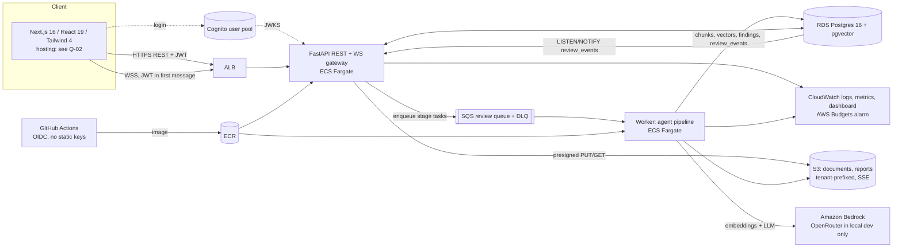

# PRD: Real-time AI Compliance Review Copilot

| | |
|---|---|
| **Owner** | Bharath (full-stack developer) |
| **Status** | Draft v0.1 · 2026-10-05 IST · all decisions provisional until Bharath confirms (see [Decisions log](#19-decisions-log)) |
| **Sources** | [`BRIEF.md`](../BRIEF.md), [`input/engineering.md`](../input/engineering.md) (Head of Engg), [`input/design.md`](../input/design.md) + `input/design-contrast.*` (Design Head) |
| **Companions** | [`DESIGN-SYSTEM.md`](DESIGN-SYSTEM.md), [`ACCEPTANCE-CRITERIA.md`](ACCEPTANCE-CRITERIA.md), AI definitions in [`../ai/`](../ai/) (agents, frameworks, skills, rules, build) |
| **Purpose** | Portfolio project for interviews (Deloitte and similar) showing Python, applied AI, FastAPI, WebSockets and AWS |

> **Measurement status.** Nothing in this document has been measured. Every number is labelled **target** or **estimate**. The success probabilities in §17 are the Head of Engineering's judgment, not data.

---

## 1. Problem

Contract and policy compliance review is slow, manual and hard to audit. An analyst reads a DPA, MSA or security policy clause by clause, maps each clause to framework controls (GDPR articles, SOC 2 criteria, ISO/IEC 27001 Annex A controls, HIPAA sections, internal standards), judges severity, drafts remediation, and then argues the result through with a reviewer over email and spreadsheets. The evidence trail (who decided what, on which clause, and why) is reconstructed after the fact.

Generic LLM chat makes the first draft faster but is not usable for compliance work: it paraphrases instead of quoting, cites clauses that do not exist, presents guesses with false confidence, drifts into legal conclusions, and leaves no audit trail.

**Opportunity.** A copilot that drafts findings with **exact, machine-verified citations and honest confidence**, streams them live to a review team who decide together in real time, and produces an audit-ready report in which every finding has a human decision and a traceable history.

## 2. Target users and personas

| Persona | Role in app | Job to be done | What they need from us | Pain today |
|---|---|---|---|---|
| **Priya, compliance analyst** | Reviewer | Work through a 20–50 page contract against GDPR and SOC 2 and decide every finding | Findings that open on the exact clause, keyboard-speed decisions, rationale she can check, nothing hidden | Copy-pasting clauses into spreadsheets; AI tools that cite text that isn't there |
| **Jamal, reviewer / approver** (compliance lead, counsel-adjacent) | Owner | Check the team's decisions, resolve disagreements, sign off the report | A complete audit trail, a hard block on undecided items, overrides that are logged, a report an auditor accepts | Approving reports with no proof of who decided what |
| **Ana, engineering lead** | Reviewer or Viewer | Understand which security and privacy obligations the contract imposes on her team (SOC 2 / ISO 27001 controls, breach timelines, sub-processor duties) and own remediation | Plain-language remediation, control IDs she can map to her backlog, an escalation that lands on her name | Learning about contractual obligations after signature |

Secondary audience: **interviewers** evaluating the project. They should reach a populated live review in about 30 s (target) via the preloaded sample contract, and be able to inspect the eval metrics, IaC and event contract.

## 3. Goals and non-goals

**Goals**
1. Draft compliance findings for GDPR and SOC 2 in depth, with every clause-based finding citing an exact, verified span of the document. The AI abstains when it cannot cite.
2. Stream findings live to every reviewer and let a team decide together (presence, accept/reject/edit/escalate/comment) with conflict-safe, idempotent decisions.
3. Survive network drops: read-only offline, then replay from the last event id with no lost or duplicated events.
4. Produce one audit-ready report per project (PDF + JSON) with decisions, reasons, model and prompt provenance, and an attestation sign-off that locks the version.
5. Publish honest AI quality numbers from an evaluation harness, with sample sizes and confidence intervals, and gate prompt changes in CI.
6. Run on AWS via IaC and CI/CD at demo-scale cost.

**Non-goals (all phases unless noted)**
- Legal advice or a compliance verdict on the organisation. The product says what the reviewed text does or does not address ([`ai/rules/02-no-legal-advice.md`](../ai/rules/02-no-legal-advice.md)).
- Full control catalogues for ISO/IEC 27001, HIPAA or Internal Policy in the MVP. They ship as smaller packs (§6).
- Verbatim ISO/IEC 27001 or AICPA SOC 2 control text. Packs store official IDs plus paraphrased summaries only.
- Processing real confidential data. The demo uses synthetic or public sample contracts only.
- Auto-accepting findings at any confidence level.
- OCR of scanned documents (Phase 2), SSO/SAML (stretch), auto-redlining (stretch), DOCX export (stretch).
- Multi-region and multi-environment deployment (stretch).

## 4. Success metrics (all are **targets**, not measurements)

| Area | Metric | Target |
|---|---|---|
| Citation integrity | Citation existence (quote is an exact substring at the stated offsets) | **100%**, enforced at runtime; failures are dropped and counted |
| Citation integrity | Schema violations in published findings | **0** |
| AI quality | Precision / recall / F1, severity accuracy, citation support, hallucination rate, calibration (ECE) on gold set v0 | Reported with sample sizes and bootstrap 95% CIs. No absolute quality target is set until a first baseline exists. The CI gate blocks regressions (F1 or citation support drop > 3 pts, hallucination rise > 2 pts) |
| Robustness | Injection fixtures | No regression; recall on injected docs matches the clean twin docs |
| Latency | Time to first finding (20-page doc, 1 framework) | p50 ≤ 20 s, p95 ≤ 45 s |
| Latency | Full review (20-page doc, 2 frameworks) | p50 ≤ 3 min, p95 ≤ 6 min |
| Realtime | Event persisted → delivered | p95 ≤ 500 ms |
| Realtime | Decision round-trip to all clients | p95 ≤ 400 ms |
| Realtime | Lost or duplicated persisted events across reconnects | **0** |
| Cost | Per review | ≤ $0.50 (20 pages, 1 framework), ≤ $1.00 (2 frameworks) |
| Cost | Demo environment | ≤ $75/month |
| Accessibility | axe contrast violations on review, upload and report screens, both themes | **0** |
| Demo | Sample contract → populated live review | ≈ 30 s |
| Delivery | Deployed MVP on AWS with one end-to-end collaborative review and published eval numbers | Within 3 weeks (≈50% likely per §17) |

## 5. Frameworks

| Framework | Code | MVP depth | Citation rule | Pack |
|---|---|---|---|---|
| GDPR (Regulation (EU) 2016/679) | `GDPR` | **In depth**: ~15–25 controls (target), in gold set v0 | Public law: articles may be cited and quoted | [`ai/frameworks/gdpr/`](../ai/frameworks/gdpr/) |
| SOC 2 (AICPA Trust Services Criteria) | `SOC2` | **In depth**: ~15–25 controls (target), in gold set v0 | Copyrighted: official IDs (e.g. `CC6.1`) + paraphrased summaries only | [`ai/frameworks/soc2/`](../ai/frameworks/soc2/) |
| ISO/IEC 27001:2022 | `ISO27001` | **Smaller pack**, labelled `Preview · Limited control coverage` | Copyrighted: Annex A IDs (e.g. `A.5.15`) + paraphrased summaries only | [`ai/frameworks/iso27001/`](../ai/frameworks/iso27001/) |
| HIPAA (45 CFR Parts 160/164) | `HIPAA` | **Smaller pack**, `Preview` | Public regulation: sections may be cited and quoted | [`ai/frameworks/hipaa/`](../ai/frameworks/hipaa/) |
| Internal Policy | `INTERNAL` | **Sample pack + validated YAML upload** (D-07), `Preview` | Tenant-authored | [`ai/frameworks/internal-policy/`](../ai/frameworks/internal-policy/) |

Engineering sized the smaller packs at 5–8 controls. The packs in [`ai/frameworks/`](../ai/frameworks/README.md) are larger: the `pack.yaml` files hold GDPR 20, SOC 2 19, ISO 27001 22, HIPAA 20 and Internal Policy 5 (template) controls (the index README now matches; C-20 resolved). Either way, only GDPR and SOC 2 are **evaluated and claimed in depth** in the MVP. The other packs carry the `Preview` label and report "not yet measured" until gold set v1 covers them. Uncertain citations would carry `verify: unverified` and cannot be loaded in prod strict mode. As of 2026-10-05, every control in the GDPR, SOC 2, ISO 27001 and HIPAA packs is `confirmed` against primary sources (see each pack README).

## 6. Scope

Follows engineering's recommended cut: GDPR and SOC 2 deep, everything else proves the format.

| Capability | MVP (weeks 1–3) | Phase 2 (weeks 4–6) | Stretch |
|---|---|---|---|
| Auth & roles | Cognito login, one tenant per org, roles Owner / Reviewer / Viewer | Invite flows polish, per-tenant cost dashboard | SSO/SAML, multi-org admin |
| Projects & documents | Multiple documents per project; text-layer PDF, DOCX, TXT; ≤ 10 MB, ≤ 50 pages | OCR via Textract; partial-parse "Continue anyway" | Document version diff ("re-review changed clauses only") |
| Frameworks | GDPR + SOC 2 deep; ISO 27001, HIPAA smaller packs; Internal Policy sample pack + schema-validated YAML upload | Full ISO 27001, HIPAA and Internal packs; in-app Internal Policy editor | Pack marketplace |
| AI pipeline | Extract → map → score → remediate, verified citations, abstain, calibrated confidence bands | Reviewer-decision feedback loop into the gold-set triage queue | Multi-agent debate, auto-fix redlines |
| Realtime | Token streaming of findings (fallback: whole-finding events), presence, decisions, comments, reconnect + replay, read-only offline | Notifications (escalations, mentions) | Offline outbox, presence cursors in the document |
| Document view | Parsed text with clause highlights | Rendered PDF view with overlay highlights | — |
| Report | One per project, per-framework sections, PDF + JSON, draft watermark, attestation sign-off that locks the version | — | Document SHA-256 hash, signed PDF (KMS), tamper-evident hash chain over `review_events`, DOCX export |
| Eval | Gold set v0, CLI, CI smoke gate, metrics page | Gold v1 (~40 docs, all 5 frameworks, 2nd labeler on 20%) | Online eval from reviewer decisions, active learning |
| Infra | Terraform (one env), GitHub Actions + OIDC, CloudWatch dashboard, budget alarm, scheduled scale-down | — | Multi-env, blue/green, autoscaling policies, public sandbox with rate limits |
| UX extras | Undo (8 s), keyboard map, onboarding, empty/skeleton states | ⌘K palette, batch actions, "Mark as duplicate", comment editing | Threads, reactions, @mentions |

**Cut order if behind schedule** (engineering, adjusted by D-10): PDF report (ship JSON + HTML first) → presence → smaller packs → switch token streaming to the whole-finding fallback flag. **Never cut** citation validation or the eval harness.

## 7. User stories

**Analyst (Reviewer)**
- US-01 As an analyst, I create a project, select frameworks and upload several documents so one review covers the whole contract set.
- US-02 As an analyst, I see findings appear while analysis runs, without my list or focus jumping, so I can start deciding immediately.
- US-03 As an analyst, I jump from a finding to the exact highlighted clause and back with one key, so I can check the evidence.
- US-04 As an analyst, I accept, reject (with a reason), edit or escalate a finding with keyboard shortcuts, and undo within 8 s.
- US-05 As an analyst, I see low-confidence findings flagged inside their severity group and can filter for them, so a doubtful critical is never buried.
- US-06 As an analyst, when my connection drops I keep reading, my drafts are kept, and on reconnect I see what changed while I was away.

**Reviewer / approver (Owner)**
- US-07 As an owner, I see who decided what, when and why on every finding and in a project audit log.
- US-08 As an owner, I can override any decision with a reason, and the override is logged.
- US-09 As an owner, I cannot sign off while findings are undecided, and I can jump to each one.
- US-10 As an owner, I sign off with an attestation that locks the report version; later changes create a new version and mark the old one superseded.
- US-11 As an owner, I export one combined report (PDF + JSON) with a section per framework.
- US-12 As an owner, I upload our Internal Policy as YAML and get clear validation errors if it is malformed.

**Engineering lead (Reviewer or Viewer)**
- US-13 As an engineering lead, I see SOC 2 / ISO 27001 findings with control IDs and plain-language remediation I can turn into tickets.
- US-14 As an engineering lead, when a finding is escalated to me I see it live with my name on it (no notification in the MVP).
- US-15 As a viewer, I can read everything but cannot change anything, and the UI tells me why.

**Interviewer / Bharath**
- US-16 As an interviewer, I click "Try with a sample contract" and see a live, populated review in about 30 s.
- US-17 As Bharath, I run `eval run` and get metrics with sample sizes and a diff against the baseline, and CI blocks a regressing prompt change.

## 8. Functional requirements

| ID | Requirement | Phase |
|---|---|---|
| FR-01 | Cognito sign-in; JWT verified on every REST call and on the WebSocket hello message | MVP |
| FR-02 | Roles per project: **Owner** (manage project, invite, sign off, override any decision), **Reviewer** (decide and comment), **Viewer** (read-only) | MVP |
| FR-03 | Projects hold multiple documents and a set of selected frameworks | MVP |
| FR-04 | Upload via presigned S3 PUT; accept text-layer PDF, DOCX, TXT ≤ 10 MB / ≤ 50 pages; reject scanned, encrypted, oversize and unsupported files with specific messages | MVP |
| FR-05 | A visible "Don't upload real confidential data. Use synthetic or public samples." notice on first run and on the upload screen | MVP |
| FR-06 | Preloaded synthetic sample contract for one-click demo | MVP |
| FR-07 | Parse → normalise → chunk with char offsets and heading paths → embed (pgvector) | MVP |
| FR-08 | Review pipeline per selected framework: clause extraction → control mapping → gap/risk scoring → remediation → citation verification → publish ([`ai/agents/`](../ai/agents/README.md)) | MVP |
| FR-09 | Findings carry control ref, severity, confidence band + reason, rationale, remediation, citations (or absence evidence for gaps), and model/prompt/pack provenance | MVP |
| FR-10 | Token streaming of rationale/remediation (`finding.delta`), with a server flag that falls back to whole-finding events | MVP |
| FR-11 | Live presence (who is here, which finding they are on) | MVP |
| FR-12 | Decisions: accept, reject (reason), edit (severity change needs a reason), escalate (assignee + reason), reopen/change decision (reason), comment; optimistic concurrency and idempotency | MVP |
| FR-13 | Escalate sets `status = escalated` and an assignee, broadcast live to everyone; no notifications | MVP |
| FR-14 | Append-only audit trail on each finding and as a project log; JSON export | MVP |
| FR-15 | Reconnect with replay from `lastSeq`; snapshot resync when the gap exceeds the replay window; read-only while disconnected | MVP |
| FR-16 | Document pane shows parsed text with severity highlights linked both ways to findings | MVP |
| FR-17 | One report per project combining selected frameworks with per-framework sections; PDF + JSON; draft watermark until signed | MVP |
| FR-18 | Sign-off attestation by Owner, blocked while findings are undecided; locks the version; later changes create v(n+1) | MVP |
| FR-19 | Internal Policy: sample pack + YAML upload validated against the pack schema | MVP |
| FR-20 | Eval harness CLI, gold set v0, CI smoke gate, metrics page | MVP |
| FR-21 | Rendered PDF document view | Phase 2 |
| FR-22 | OCR for scanned PDFs | Phase 2 |
| FR-23 | Notifications for escalations | Phase 2 |
| FR-24 | In-app Internal Policy pack editor | Phase 2 |
| FR-25 | Document hash / signed PDF / tamper-evident event chain | Stretch |

## 9. AI behaviour

Defined in detail by the agent specs and rules in [`ai/agents/`](../ai/agents/README.md) and [`ai/rules/`](../ai/rules/). Product-level contract:

1. **Cite or abstain.** A clause-based finding must cite a verbatim span `[charStart, charEnd)` of the normalised document text. The [Citation Verifier](../ai/agents/06-citation-verifier.md) checks it deterministically before publication. A finding that fails is retried once, then retracted and counted ("2 findings discarded: citation check failed" in the analysis summary). Gap (absence) findings carry absence evidence (sections searched, queries, best similarity) instead of a quote. If the model cannot ground a claim, it abstains; abstentions are logged for eval, not shown. Rule: [`ai/rules/01-cite-or-abstain.md`](../ai/rules/01-cite-or-abstain.md).
2. **Closed control list.** Control IDs come only from the pinned framework packs. Unknown IDs are dropped.
3. **Confidence.** A 0..1 score is calibrated against the gold set (reliability curve / ECE) per [`ai/skills/confidence-calibration/`](../ai/skills/confidence-calibration/SKILL.md); routing thresholds live in [`ai/rules/runtime-config.yaml`](../ai/rules/runtime-config.yaml) (`high_min 0.85`, `low_below 0.70` provisional per Q-07, `abstain_below 0.55`; below 0.55 the agent abstains and the control is listed as "needs manual check" in coverage) and [`ai/rules/04-confidence-thresholds.md`](../ai/rules/04-confidence-thresholds.md). The UI shows a **band (High / Medium / Low) with a one-line reason**, never a percentage. Until calibration exists, the tooltip says "Uncalibrated estimate". Low-confidence findings stay **inside their severity group** with a visible marker and a filter (D-01). 
4. **No legal advice.** Rationale, remediation and report summary describe what the text does or does not address. They never state that an organisation "is compliant" or "is non-compliant". The report carries a disclaimer on the cover and every page footer. Rule: [`ai/rules/02-no-legal-advice.md`](../ai/rules/02-no-legal-advice.md).
5. **The human decides.** No auto-accept code path at any confidence. The final report includes only findings with a human decision; undecided findings block sign-off.
6. **Untrusted input.** Document text is passed only inside delimited data blocks; the model has no tools, network or data access; output is schema-locked (forced tool call) and validated. Rules: [`ai/rules/06-prompt-injection-defence.md`](../ai/rules/06-prompt-injection-defence.md), [`ai/rules/07-schema-validation.md`](../ai/rules/07-schema-validation.md).
7. **Severity.** One of critical / high / medium / low / info per the rubric in [`ai/rules/03-severity-rubric.md`](../ai/rules/03-severity-rubric.md). Reviewers can change severity with a reason.
8. **Provenance and reproducibility.** Every finding records provider, pinned model ID, prompt version and pack version. Reviews pin pack versions. Budgets and timeouts live in [`ai/rules/runtime-config.yaml`](../ai/rules/runtime-config.yaml).
9. **Cross-framework mappings are indicative.** A finding never claims that satisfying one framework satisfies another.
10. **Models.** Amazon Bedrock in all deployed environments, with model tiering (fast model for extraction/mapping, stronger model for scoring/remediation). OpenRouter behind the same `LLMProvider` interface for local development with synthetic or public documents only.

## 10. Real-time collaboration

- **One socket per review**; the JWT goes in the first message, never in the URL.
- **Persisted vs ephemeral events.** Every persisted state change (finding created/updated, decision, comment, status) is appended to `review_events` with a per-review monotonic `seq` in the same transaction (transactional outbox). Token deltas and presence are ephemeral and never replayed.
- **Fan-out.** API tasks `LISTEN` on Postgres and push to their sockets; no Redis or API Gateway WebSockets at demo scale.
- **Decisions.** Each carries `clientMsgId` (idempotency) and `findingVersion` (optimistic concurrency). A stale submit gets `version_conflict` plus the current finding; the UI shows "Jamal rejected this 5 s ago: '…' [Keep theirs]", and **Owner** additionally sees [Override…] (reason required, logged as an override).
- **Escalation.** `status = escalated` + assignee, broadcast live. No notification in the MVP.
- **Presence.** Avatars in the top bar and on findings; idle after 2 min; removed after 2× heartbeat of silence.
- **Disconnect.** Read-only with a "Reconnecting… changes are paused" banner; drafts kept locally; unacknowledged decisions are verified against the server on reconnect and never silently resubmitted. On reconnect the client sends its last applied `seq`; the server replays the gap or requires a snapshot resync; a "While you were away" chip summarises others' changes.

## 11. Architecture summary

| Layer | Choice |
|---|---|
| API | Python 3.12, FastAPI, Pydantic v2, SQLAlchemy 2 + Alembic |
| WebSockets | FastAPI native WS on the API service; fan-out via Postgres LISTEN/NOTIFY |
| Worker | Same codebase, separate Fargate service, SQS long-poll, 3 retries then DLQ |
| Data | RDS Postgres 16 + pgvector, smallest burstable, single-AZ |
| LLM / embeddings | Amazon Bedrock, tiered and pinned models; embeddings via Bedrock (Titan Text Embeddings or Cohere); model per chunk stored (see Q-03) |
| Parsing | pypdf / pdfplumber, python-docx (char offsets) |
| Reports | Jinja2 HTML → WeasyPrint PDF |
| Auth | Cognito user pool, JWT (RS256) via JWKS |
| IaC / CI | Terraform recommended (Q-01); GitHub Actions → ECR → ECS with OIDC |
| Frontend | Next.js 16, React 19, TypeScript, Tailwind 4; TS types generated from OpenAPI and the WS schema |

Pipeline detail (seven agents, stage tasks, budgets): [`ai/agents/README.md`](../ai/agents/README.md).

## 12. Data model summary

Every tenant-owned row carries `tenant_id`; IDs are ULIDs. Pydantic models are generated from the shared schemas in [`ai/agents/schemas/`](../ai/agents/schemas/).

| Entity | Key fields | Notes |
|---|---|---|
| `tenant`, `user`, `membership` | `membership.role ∈ {owner, reviewer, viewer}` per project | D-03 |
| `project` | name, selected framework codes, created_by | Holds many documents and one report lineage (D-06) |
| `document` | filename, mime, s3_key, sha256, page_count, status (uploaded/parsing/parsed/failed), pii_detected | Text-layer PDF, DOCX, TXT |
| `chunk` | document_id, ordinal, text, char_start, char_end, page, heading_path, embedding, embedding_model | `docText.slice(char_start, char_end) == text` |
| `framework`, `control` | code, version; control ref (e.g. `GDPR Art. 28(3)(a)`, `SOC2 CC6.1`, `ISO27001 A.5.15`), paraphrased summary, check guidance, default severity, embedding | Loaded from pinned packs; `framework.tenant_id` set for Internal packs |
| `review` | project_id, document_ids, framework_codes, pack versions, status (queued/running/completed/failed/cancelled), tokens, cost_usd, last_seq | One review run over a project's documents |
| `finding` | control_id, kind, title, rationale, remediation, severity, confidence (0..1 + band + reason), citations or absence evidence, status (open/accepted/rejected/edited/escalated), assignee_id, version, model provenance | `version` for optimistic concurrency |
| `review_decision` | finding_id, action (accept/reject/edit/escalate/reopen/override), actor, server time, reason, before/after, finding_version, client_msg_id | Append-only; never updated or deleted |
| `comment` | finding_id, author, body | Flat thread |
| `review_event` | review_id, seq, type, payload, ts | Outbox and replay log; source of truth for realtime |
| `report`, `report_version` | project_id, version, status (draft/signed/superseded), framework sections, pdf/json s3 keys | One report per project, versioned |
| `signoff` | report_version_id, signer, attested_at, statement | Attestation; hash/signature is stretch |
| `eval_run` (repo files) | `eval/gold/vN/`, `eval/results/<git-sha>.json` | Versioned in git, not in the DB |

Changes from the engineering input, made to apply the decisions: `review.document_ids` (multi-document projects), `finding.status` gains `escalated` + `assignee_id`, decision actions gain `escalate` and `override`, and `report`/`signoff` entities are added.

## 13. WebSocket event contract summary

Endpoint `wss://…/v1/reviews/{reviewId}/ws`. Envelope: `{ v: 1, type, id, seq?, reviewId, ts, correlationId?, payload }`. `seq` is present on every persisted server event. The server supports schema versions N and N-1. Full machine-readable contract: [`ai/agents/schemas/events.yaml`](../ai/agents/schemas/events.yaml) (reconciled to this contract on 2026-10-05 per the Q-08 default; see §21).

| Direction | Event | Persisted (`seq`) | Purpose |
|---|---|---|---|
| C→S | `client.hello {token, lastSeq?, clientVersion}` | — | Auth + resume |
| C→S | `client.ack`, `client.ping` | — | Buffer trim, liveness |
| C→S | `presence.update {state, focusFindingId?}` | — | Presence |
| C→S | `decision.submit {clientMsgId, findingId, action, findingVersion, reason?, edits?, assigneeId?}` | — | Accept / reject / edit / escalate / reopen / override |
| C→S | `comment.add {clientMsgId, findingId, body}` | — | Comment |
| S→C | `server.welcome {userId, roles, currentSeq, heartbeatMs}` | — | Session ready |
| S→C | `replay.begin` / `replay.end`, `resync.required {reason, snapshotUrl}` | — | Resume protocol |
| S→C | `review.status {status, progress}` | yes | Stage progress |
| S→C | `finding.delta {draftId, field, text}` | **no** (ephemeral) | Token streaming (flag-controlled) |
| S→C | `finding.created`, `finding.updated` | yes | Verified finding; supersedes deltas for the draft |
| S→C | `decision.applied`, `decision.rejected {code: version_conflict\|forbidden\|invalid, current?}` | applied: yes | Decision outcome |
| S→C | `comment.added` | yes | Comment broadcast |
| S→C | `presence.snapshot`, `presence.diff` | no | Presence |
| S→C | `server.heartbeat {serverTime, currentSeq}`, `server.pong`, `error {code, retryable, fatal}` | no | Liveness, errors |

**Resume protocol.** Client tracks highest applied `seq` → reconnect sends `client.hello{lastSeq}` → server replays `(lastSeq, currentSeq]` between `replay.begin`/`replay.end` if within the window (target ≥ 24 h or last 5,000 events), else `resync.required` → client ignores `seq ≤ lastSeq` → ephemeral events are not replayed (a missed draft appears via `finding.created`) → no heartbeat within 2× `heartbeatMs` triggers reconnect with exponential backoff and jitter (1 s → 30 s cap).

## 14. Non-functional requirements (all **targets**)

| Area | Target |
|---|---|
| Time to first finding | p50 ≤ 20 s, p95 ≤ 45 s (20-page doc, 1 framework) |
| Full review | p50 ≤ 3 min, p95 ≤ 6 min (20-page doc, 2 frameworks) |
| Streaming latency | p95 ≤ 500 ms persisted → delivered; first `finding.delta` token ≤ 3 s after generation begins |
| Decision round-trip | p95 ≤ 400 ms to all clients |
| Reconnect | First attempt ≤ 2 s after network returns; replay window ≥ 24 h or 5,000 events; heartbeat 15 s, dead after 30 s; ALB idle timeout > heartbeat |
| Concurrency | ≥ 10 reviewers on one review; ≥ 5 concurrent reviews within the targets above |
| Reliability | Worker retries 3× with backoff, then DLQ; reviews idempotent per (documents, frameworks, promptVersion); no review in `running` > 15 min |
| Cost | ≤ $0.50 per review (1 framework), ≤ $1.00 (2 frameworks); hard per-review token budget; demo env ≤ $75/month; budget alarms at 50/80/100% |
| Accessibility | WCAG 2.2 AA; see [`DESIGN-SYSTEM.md` §9](DESIGN-SYSTEM.md#9-accessibility) |
| Browser | Current evergreen browsers; layout down to a 320 px-equivalent width at 200% zoom |

## 15. Security and privacy

- **Tenant isolation:** repository layer filters every query by `tenant_id`; Postgres Row-Level Security as defence in depth; S3 keys prefixed by tenant; cross-tenant requests return 404; automated cross-tenant suite in CI.
- **AuthN/Z:** Cognito JWT (RS256) on every REST call and on WS hello; expiry enforced mid-socket (`auth_expired` → refresh and reconnect); role checks server-side on every decision, comment, override and sign-off.
- **Data protection:** S3 SSE, private bucket, short-lived presigned URLs, lifecycle expiry; RDS encryption; TLS everywhere. User-triggered delete purges S3 objects, chunks and embeddings within 24 h (target).
- **Logs:** no document text or quotes, only IDs and hashes. Optional PII detection flags documents ([`ai/rules/05-pii-handling.md`](../ai/rules/05-pii-handling.md), [`ai/skills/pii-phi-detection/`](../ai/skills/pii-phi-detection/SKILL.md)).
- **LLM data handling:** Bedrock with no provider data retention; OpenRouter is dev-only and limited to synthetic or public documents.
- **Prompt injection:** documents are delimited untrusted data; the model has no tools; output is schema-locked and validated; control IDs come from a closed list; citations are verified; an injection fixture set runs in the CI eval gate.
- **Supply chain / CI:** GitHub OIDC to AWS, no static keys.
- **Demo data policy:** synthetic or public sample contracts only, with a visible "don't upload real confidential data" notice (D-08).
- **Licensing:** ISO/IEC 27001 and SOC 2 control text paraphrased, official IDs only. GDPR and HIPAA may be quoted.

## 16. Evaluation plan

| Item | Plan |
|---|---|
| Gold set v0 (MVP) | ~12–15 documents (DPAs, MSAs, privacy and security policies) → ~150–250 labelled items (target) across GDPR + SOC 2, plus ~3 injection fixtures |
| Sources | Synthetic documents with seeded defects (e.g. sub-processor clause removed, breach notice "within 30 days"); public contracts and policies (e.g. CUAD v1, licensed **CC BY 4.0** by The Atticus Project, so attribution is required); hand-written edge cases (negations, cross-references, clauses split across pages). Synthetic vs real reported separately |
| Labelling | Pipeline pre-labels → human confirms or edits (YAML in the MVP) → label fields `docId, charStart, charEnd, controlRef, verdict, severity, notes, labeler, labelVersion`; gaps keyed by (doc, control). Versioned in `eval/gold/vN/`, immutable once released |
| Matching | Same `controlRef` and character IoU ≥ 0.5; gaps match on (doc, control) |
| Metrics | Precision / recall / F1 (overall, per control, per severity, per framework, synthetic vs real); severity accuracy (exact, ±1, confusion matrix); citation existence (must be 100%); citation support (LLM judge with fixed rubric, judge validated on ~50 human pairs); hallucination rate; consistency (3 runs: Jaccard, severity agreement, confidence std-dev); calibration (ECE, sets band thresholds); injection robustness; cost and latency |
| Statistics | Bootstrap 95% CIs; per-control metrics with < 5 gold items flagged "insufficient data" |
| Harness | `eval run --gold v0 --frameworks GDPR,SOC2 --prompt-version X` → `eval/results/<git-sha>.json` + Markdown diff vs baseline; response cache keyed by (model, prompt hash, input hash) |
| CI gate | On changes to `prompts/`, `pipeline/`, `frameworks/`: smoke subset (~4 docs, ≤ $2/run target). Fails if citation existence < 100%, schema violations > 0, F1 or citation support −3 pts, hallucination +2 pts, or any injection fixture regresses |
| Publication | Full suite nightly or before release tags; metrics page in the README shows "not yet measured" until real numbers exist; baselines change only via an explicit PR |
| Growth (Phase 2) | Rejected findings and edited severities → triage queue → human adjudication → gold set; every production bug becomes a regression case |

How-to for coding agents: [`ai/build/skills/run-eval-harness/SKILL.md`](../ai/build/skills/run-eval-harness/SKILL.md). Deploy runbook: [`ai/build/skills/deploy-to-aws/SKILL.md`](../ai/build/skills/deploy-to-aws/SKILL.md). Repo conventions for coding agents: [`ai/build/AGENTS.md`](../ai/build/AGENTS.md).

## 17. Risks and success estimate

**Success estimate (Head of Engineering).** This is **judgment, not data**: one developer with AI coding agents under tight usage limits; nothing has been built or measured.

| Dimension | Estimate | Why |
|---|---|---|
| Build (MVP features working locally) | **70%** | Each piece is well understood; together they are a lot for one person in 2–3 weeks |
| Deploy (AWS via IaC + CI/CD) | **70%** | Fargate + ALB WebSockets + RDS/pgvector + Cognito + SQS each have setup snags (IAM, VPC, Bedrock access) |
| Run & maintain (stable for demos 3+ months, cost controlled) | **65%** | Idle cost and model/API drift; mitigated by scheduled scale-down and pinned model IDs |
| **Overall in ~3 weeks** | **≈50%** | Correlated dimensions, so not a straight product |
| **Overall with 4–5 weeks or the §6 scope cuts** | **≈75%** | |

| # | Risk | Mitigation |
|---|---|---|
| 1 | Scope vs time and agent usage | GDPR + SOC 2 deep, others as smaller packs; vertical slices; hard freeze on day 15; agent usage on boilerplate (IaC, types, UI) |
| 2 | AI quality (false positives, wrong citations, unstable severity) | Deterministic citation check; closed control list; structured output; calibrated bands; eval gate; show "needs careful review" instead of hiding uncertainty |
| 3 | Gold dataset effort and single-labeler bias | Start small with seeded synthetic docs; LLM pre-labels + human confirmation; report sample sizes and CIs; 2nd labeler in v1 |
| 4 | AWS friction (Bedrock access, ALB idle timeout, Cognito JWT, NAT cost) | One region; request Bedrock access on day 1; ALB idle timeout + heartbeats; no NAT gateway (public-subnet tasks or VPC endpoints); budget alarms on day 1 |
| 5 | WebSocket resume correctness | Persisted per-review `seq` log; client dedupe; LISTEN/NOTIFY fan-out; snapshot fallback |
| 6 | Document parsing | Text-layer PDF, DOCX, TXT only; clear rejection of scanned PDFs; OCR in Phase 2 |
| 7 | Framework content licensing | Paraphrased summaries + official IDs for ISO and SOC 2 |
| 8 | Security of uploaded content | Injection defences, schema-locked output, log redaction, synthetic-only demo data |
| 9 | Contract drift between `engineering.md` and `ai/agents/schemas/` (event names, enums) | Reconcile before week 2 (Q-08); generate Pydantic and TS types from one schema |

## 18. Milestone plan (estimate, 3 weeks + buffer)

| Window | Milestone | Exit criteria |
|---|---|---|
| Day 1 | Accounts and guardrails | Bedrock model access requested; AWS Budgets alarm; repo, CI skeleton, Terraform state backend |
| Days 1–4 | **M1 Foundations** | Cognito login; projects; presigned upload; parse → chunk → embed; tenant filter + RLS; cross-tenant test green |
| Days 5–8 | **M2 AI pipeline (GDPR)** | Extract → map → score → remediate → verify for GDPR; findings persisted with valid citations; gold v0 started; `eval run` CLI working |
| Days 8–11 | **M3 Realtime** | WS hello/welcome, `finding.created` streaming, token deltas behind flag, decisions with concurrency + idempotency, presence, resume/replay, read-only offline |
| Days 11–13 | **M4 SOC 2 + smaller packs + report** | SOC 2 pack deep; ISO 27001, HIPAA, Internal sample + YAML upload; project report JSON → HTML → PDF; attestation sign-off and versioning |
| Days 13–15 | **M5 Deploy** | Terraform apply of full stack; GitHub Actions OIDC deploy; CloudWatch dashboard; scheduled scale-down; eval CI gate on PRs |
| **Day 15** | **Feature freeze** | Apply cut order if any of M1–M5 is open |
| Days 16–21 | **M6 Hardening and demo** | Accessibility pass (axe, keyboard, grayscale); full eval run published with CIs; demo script and sample contract; README |
| Weeks 4–5 | Buffer / Phase 2 start | Lifts the overall estimate from ≈50% to ≈75% |

## 19. Decisions log

All decisions are **provisional** until Bharath confirms. "Source" records where the disagreement came from.

| ID | Decision | Rationale | Source | Status |
|---|---|---|---|---|
| D-01 | **Low-confidence findings stay inside their severity group** with a visible low-confidence marker (dashed border, "Needs careful review") and a filter. Replaces engineering AC-7's "sort after confident findings" | A low-confidence critical must never be buried under confident lows | Design §3.4 / §6.4 vs Engg AC-7 | Provisional |
| D-02 | **MVP sign-off is an attestation that locks the report version.** Later changes create v(n+1) and mark the prior version superseded. Document hash / signed PDF (and the KMS signing and object lock described in [`ai/agents/07-report-composer.md`](../ai/agents/07-report-composer.md)) are **stretch** | Engineering puts signed reports out of MVP scope; an attestation plus a lock is enough for the demo | Design §6.8, Engg §3.1 | Provisional |
| D-03 | **Roles: Owner** (manages the project, signs off, can override any decision; override logged in the audit trail with reason and before/after), **Reviewer** (decides and comments on findings), **Viewer** (read-only). In a version conflict, Reviewers get "Keep theirs"; only Owners get "Override…" | Engineering had owner/reviewer only; design needed a signer and an override policy | Design §6.1–6.2 | Provisional |
| D-04 | **Escalate (MVP)** sets `status = escalated` plus an assignee, visible live to everyone. Reason required. **Notifications are Phase 2** | No notification system in the MVP | Design §6.13 | Provisional |
| D-05 | **Document pane shows parsed text with clause highlights**; rendered PDF view is Phase 2 | Char-offset citations map directly to parsed text; much simpler | Design §6.5 | Provisional |
| D-06 | **Multiple documents per project. One report per project**, combining the selected frameworks with per-framework sections, exportable as PDF and JSON | Matches the "projects" API and real contract sets (MSA + DPA) | Design §6.6, §6.9 | Provisional |
| D-07 | **Internal Policy:** MVP ships a sample pack plus YAML upload validated against the pack schema; in-app editor is Phase 2 | Proves custom packs without editor UI cost | Design §6.7, Engg Phase 2 | Provisional |
| D-08 | **Synthetic or public sample contracts only**, with a visible "don't upload real confidential data" notice | Demo has no DPA with any data owner; OpenRouter is dev-only | Design §6.11, Engg PII NFR | Provisional |
| D-09 | **Offline is read-only** with a reconnecting banner; changes are replayed from the last event id (`lastSeq`) on reconnect. Offline outbox is stretch | Audit time must be server time | Design §6.10 | Provisional |
| D-10 | **Token streaming of findings stays in the MVP** (it is the showcase), with a server flag that falls back to whole-finding events. The fallback replaces "cut token streaming" in the cut order | Keeps the demo's signature moment and a safe fallback | Design §6.12 vs Engg cut order | Provisional |
| D-11 | Confidence shown as **bands with a reason**, never a percentage; thresholds come from calibration on the gold set | Honest confidence; avoids false precision | Design §3.4 / §6.4 | Provisional (thresholds open, Q-07) |
| D-12 | **Edit** changes title, severity (reason required), rationale and remediation; it is stored as a decision with before/after and bumps `finding.version`; shown as "Accepted · edited" with a diff against the AI original. Control re-mapping is open (Q-09) | Engineering's `ReviewDecision.before/after` covers these fields | Design §6.3 | Provisional |

## 20. Open questions for Bharath

Engineering's open decisions, each with the team's recommendation:

| ID | Question | Recommendation |
|---|---|---|
| Q-01 | **Terraform vs CDK?** | **Terraform.** More widely recognised in consulting interviews and multi-cloud. CDK (Python) only if you prefer one language end to end |
| Q-02 | **Frontend hosting?** | **Vercel for the Next.js frontend, AWS for everything else** (simplest). If you want an all-AWS story, use **Amplify Hosting** or **S3 + CloudFront** |
| Q-03 | **Bedrock models and region?** | Region **us-east-1**: broadest coverage, and every recommended model is available there through US geo and global inference profiles. `ap-south-1` Mumbai is a viable alternative: Haiku 4.5 and Sonnet 5 both have India geo profiles (`in.*`), but Haiku 4.5 does not support structured outputs through `in.*`. Fast tier: **Claude Haiku 4.5** (`us.anthropic.claude-haiku-4-5-20251001-v1:0`, $1.10 / $5.50 per 1M tokens), or Amazon Nova 2 Lite, for extraction and mapping. Reasoning tier: **Claude Sonnet 5** (`us.anthropic.claude-sonnet-5`, $2.20 / $11) for scoring and remediation. Embeddings: **Amazon Titan Text Embeddings V2** (`amazon.titan-embed-text-v2:0`, $0.02), or Cohere Embed on Bedrock. IDs come from the AWS Bedrock model cards and prices from the AWS Price List API, us-east-1, both checked 2026-10-05. Haiku 4.5's AWS card shows "EOL no sooner than Oct 16, 2026", so model access and lifecycle status are an explicit deploy checklist step ([`deploy-to-aws`](../ai/build/skills/deploy-to-aws/SKILL.md) steps 3 and 8). Pin the IDs in SSM (`/cc/<env>/bedrock/{fast,reasoning,embed}`), which `ai/rules/runtime-config.yaml` reads via env |
| Q-04 | **Demo uptime: 24/7 or scheduled?** | **Scheduled or scale-to-zero** for Fargate outside demo windows to control cost (target ≤ $75/month). RDS stop/start on a schedule if needed |
| Q-05 | **Is the eval set public?** | **Yes, a public synthetic set** (plus public documents whose licences are verified). ISO and SOC 2 content stays paraphrased with official IDs |
| Q-06 | **Tenancy model?** | **Single database with `tenant_id` on every row and row-level checks** (repository filter + Postgres RLS), not schema-per-tenant |

Further items surfaced while merging:

| ID | Question | Recommendation |
|---|---|---|
| Q-07 | Confidence band thresholds (High / Medium / Low) vs the agents' routing bands (`auto` ≥ 0.85, `review` 0.55–0.85, `abstain` < 0.55 in `ai/rules/runtime-config.yaml`) | Keep the agents' thresholds for routing. Map `auto` → **High**; split `review` into **Medium** and **Low** (low-confidence marker) at a point chosen from the first calibration run on gold v0; `abstain` is never shown as a finding. Until calibrated, show "Uncalibrated estimate" |
| Q-08 | Which WS contract and Finding schema win where `input/engineering.md` §2 and [`ai/agents/schemas/`](../ai/agents/schemas/) differ (see §21, C-04 to C-09) | Make `ai/agents/schemas/` the single source (it is already wired for codegen via `packages/schemas/`), then update it to: engineering's resume protocol and 15 s heartbeat; human `edit` / `escalate` / `reopen` / `override` decision actions with required reasons; a system "needs review" flag renamed so it does not collide with the human Escalate; band `auto` renamed so it cannot be read as auto-accept |
| Q-09 | May Edit change the control mapping? | Recommend Phase 2; in the MVP a wrong mapping is rejected with "Incorrect mapping" and the reviewer adds a comment |
| Q-10 | Does the report include findings that are verified but undecided? | No in the final report (design: human decision required); allowed only in a DRAFT-watermarked export |

## 21. Known conflicts with `ai/` (resolved 2026-10-05)

`ai/` was written from the brief before the engineering and design inputs existed. On 2026-10-05 it was updated to follow this PRD's decisions. The docs win on every conflict. Where a resolution depends on an open question, `ai/` uses the recommended default from §20, so it follows any later decision on that question.

**Already consistent (unchanged):** event transport (outbox + LISTEN/NOTIFY, no Redis, `seq` resume, ephemeral deltas/presence); Terraform; GitHub OIDC; Bedrock with OpenRouter local-only; cite-or-abstain; no legal advice; paraphrased ISO/SOC 2 text; Internal Policy upload with schema validation.

| ID | Topic | Status | Resolution in `ai/` |
|---|---|---|---|
| C-01 | Report integrity | ✅ Resolved | `07-report-composer.md`, `ai/README.md`, `aws-iac.mdc`: sign-off is an Owner attestation that locks the version; changes create v(n+1). KMS signing, hashes, and Object Lock are marked stretch (FR-25). |
| C-02 | Report scope | ✅ Resolved | Composer takes `project_id`: one report per project with per-framework sections. The final report holds only human-decided findings; undecided ones block sign-off and appear only in a DRAFT export (Q-10 default). |
| C-03 | Low-confidence placement | ✅ Resolved | `rules/04`, agents README: no review queue. Low band = dashed border + "Needs careful review" + filter, staying inside its severity group (D-01). |
| C-04 | "Escalated" meaning | ✅ Resolved | System routing renamed to `systemFlags` on the finding (e.g. `critical_severity`, `absence_finding`, `verifier_disagreement`). `escalated` is reserved for the human decision with an assignee (D-04). `finding.escalated` was removed. |
| C-05 | Decision actions | ✅ Resolved | `finding.schema.yaml` + `events.yaml`: accept, reject, edit, escalate, reopen, override (Owner only). Reasons ≥ 10 chars are required for reject, escalate, reopen (except the 8 s self-undo), override, and severity edits, and enforced server-side. `needs_info` was dropped. |
| C-06 | WS handshake/resume names | ✅ Resolved | `events.yaml` adopts engineering's contract: `/v1/reviews/{id}/ws`, `client.hello`/`server.welcome`, `replay.begin`/`replay.end`, `resync.required`, `review.status`, `finding.created`/`updated`, `decision.applied`/`rejected` (Q-08 default). Two additive items: optional `review.status` counters and an ephemeral `finding.discarded` (for AC-AI-03 and AC-STR-11). |
| C-07 | Heartbeat | ✅ Resolved | `server.heartbeat` every 15 s; dead after 30 s; backoff 1 s → 30 s; ALB idle timeout 60 s. |
| C-08 | Finding status vocabulary | ✅ Resolved | `kind ∈ violation/gap/partial/compliant` (violation = contradicting text, gap = absent provision) and `status ∈ open/accepted/rejected/edited/escalated` + `assigneeId` + `version`. Drafts and retractions are pipeline-only; `not_applicable` became out-of-scope coverage. |
| C-09 | Confidence bands | ✅ Resolved | Bands are High ≥ 0.85, Medium, Low ≥ 0.55, abstain below that, each with a reason and never a percentage; "Uncalibrated estimate" until calibrated. The Medium/Low split of 0.70 is **provisional pending Q-07** calibration. Critical and absence findings are shown as their own system-flag reasons, not as a band. |
| C-10 | Roles | ✅ Resolved | Per-project membership `owner/reviewer/viewer` (D-03) in AGENTS.md, events, and the security and deploy docs. No Cognito role groups; an optional ops-only `admin` group. |
| C-11 | Environments | ✅ Resolved | `aws-iac.mdc`, `deploy-to-aws`: single `demo` env, one region, single-AZ RDS (smallest burstable); env-agnostic module layout kept for later. |
| C-12 | NAT gateway | ✅ Resolved | No NAT: public-subnet Fargate tasks with ALB-only security-group ingress, private RDS, free S3 gateway endpoint. |
| C-13 | Encryption keys | ✅ Resolved | SSE-S3 (engineering stack) in `rules/05`, `aws-iac.mdc`, and the composer; a customer-managed KMS key is stretch. Bharath can still opt for KMS as an upgrade. |
| C-14 | OCR | ✅ Resolved | Ingestion uses pypdf/pdfplumber/python-docx only and rejects scanned PDFs; Textract is gated behind `limits.ocr_enabled: false` (Phase 2). Limits are aligned to ≤ 10 MB / ≤ 50 pages. |
| C-15 | Frontend hosting | ✅ Resolved | Vercel (Q-02 default). `deploy-to-aws` covers API and workers only (no `web` image); Cognito callbacks and CORS allow the Vercel origin. |
| C-16 | Eval gates | ✅ Resolved | `run-eval-harness`, `testing.mdc`, AGENTS.md: PR smoke gate on regressions only (citation existence 100%, 0 schema violations, F1 or citation support −3 pts, hallucination +2 pts, injection). Absolute numbers are targets until a baseline exists. Gold paths and CLI follow §16. |
| C-17 | Sampling vs consistency | ✅ Resolved | Assessor runs n=1 at temperature 0, the same setting as the eval consistency runs (3× at temperature 0); the runtime self-consistency signal was removed. |
| C-18 | Review deadline | ✅ Resolved | `review_deadline_s: 900` (15 min). Controls not processed by the deadline are reported in coverage. |
| C-19 | Token budget vs cost | ✅ Resolved | `ai/agents/cost-model.md` uses Bedrock prices from the AWS Price List API (us-east-1, read 2026-10-05). Pinned US geo profiles: Haiku 4.5 $1.10/$5.50; Sonnet 5 $2.20/$11 (global $1/$5 and $2/$10). §20 Q-03 lists no prices. The old 1.5M-token budget allowed $1.50–$3.30 per review, and n=3 sampling was ≈ $1.02 for 1 framework. Now: n=1, remediation on the fast tier, ≈ $0.46 (1 fw) / ≈ $0.90 (2 fw) estimated; budget 30k + 240k tokens per framework plus a $0.48-per-framework USD guard. |
| C-20 | Pack size | ✅ Resolved | `ai/frameworks/README.md` counts fixed (20 / 19 / 22 / 20 / 5). Packs carry `code` and `maturity`; ISO 27001, HIPAA, and Internal are `Preview` and not claimed in eval until gold v1. |
| C-21 | Draft label | ✅ Resolved | The streaming draft uses "Writing…" with controls disabled ("Finding still being written") in the agents README and `frontend.mdc`; "verifying" was removed. |

Remaining dependencies: Q-07 (the Medium/Low split value), Q-02 (if all-AWS hosting is chosen instead of Vercel, add a frontend runbook), Q-03 (model and price pinning at deploy time), and the C-13 KMS upgrade (optional).
